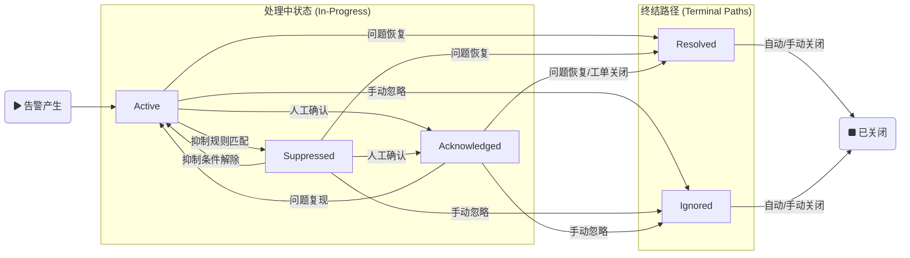

# ok

```mermaid
graph LR
    Start(fa:fa-play 告警产生) --> Active

    %% 将活跃状态组合在一起 %%
    subgraph "处理中状态 (In-Progress)"
        direction TB
        Active -- 抑制规则匹配 --> Suppressed
        Suppressed -- 抑制条件解除 --> Active
        
        Active -- 人工确认 --> Acknowledged
        Suppressed -- 人工确认 --> Acknowledged
        Acknowledged -- 问题复现 --> Active
    end

    %% 将导向关闭的状态组合在一起 %%
    subgraph "终结路径 (Terminal Paths)"
        direction TB
        Resolved
        Ignored
    end

    %% 定义从“处理中”到“终结”的路径 %%
    Active -- 问题恢复 --> Resolved
    Suppressed -- 问题恢复 --> Resolved
    Acknowledged -- 问题恢复/工单关闭 --> Resolved

    Active -- 手动忽略 --> Ignored
    Suppressed -- 手动忽略 --> Ignored
    Acknowledged -- 手动忽略 --> Ignored

    %% 最终关闭 %%
    Resolved -- 自动/手动关闭 --> Closed(fa:fa-stop 已关闭)
    Ignored -- 自动/手动关闭 --> Closed
```
